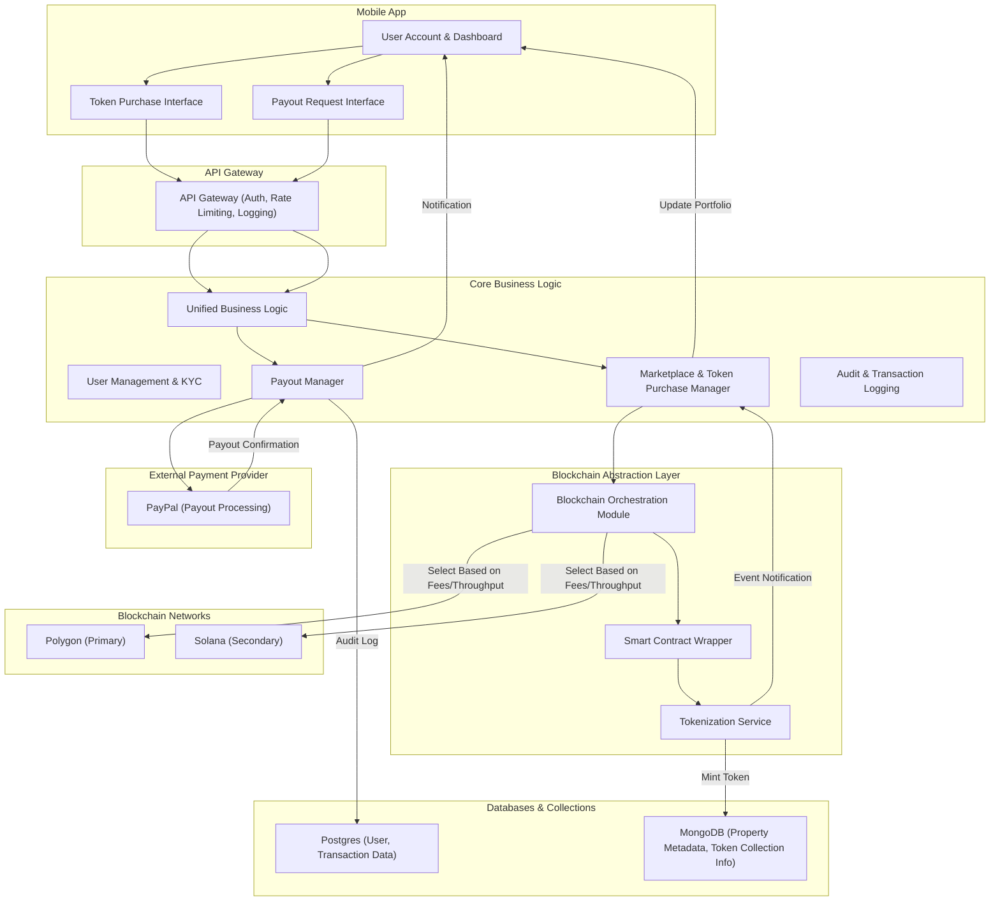

# WeHive Platform Architecture Documentation

This documentation provides a complete overview of the WeHive platform—a modern real estate investment platform that leverages blockchain technology to tokenize property investments while abstracting all complexities from the end user. The document covers system architecture, business logic, blockchain integration, tokenization, payout processes, KYC requirements, and more.

---

## Table of Contents

1. [Overview](#overview)
2. [Business Objectives](#business-objectives)
3. [High-Level Architecture](#high-level-architecture)
4. [Mobile Application](#mobile-application)
5. [API Gateway](#api-gateway)
6. [Core Business Logic](#core-business-logic)
7. [Blockchain Abstraction & Integration](#blockchain-abstraction--integration)
    - [Blockchain Choices](#blockchain-choices)
    - [Smart Contract Development & Integration](#smart-contract-development--integration)
    - [Detailed Flow Diagram](#detailed-flow-diagram)
8. [External Providers](#external-providers)
9. [Real-Time Communication & Administration](#real-time-communication--administration)
10. [Workflow Descriptions](#workflow-descriptions)
    - [User Onboarding & KYC](#user-onboarding--kyc)
    - [Token Purchase Flow](#token-purchase-flow)
    - [Payout Flow](#payout-flow)
11. [Implementation Considerations](#implementation-considerations)
12. [Final Notes](#final-notes)

---

## Overview

WeHive will be a cutting-edge real estate investment platform that simplifies property investment through tokenization. By abstracting blockchain complexities, the platform allows users to create accounts, complete KYC, and invest without needing to understand or interact directly with blockchain technologies.

---

## Business Objectives

- **User Simplicity:** Offer a seamless onboarding process with simple account creation, KYC verification, and a familiar investing experience.
- **Transparency & Security:** Provide immutable record-keeping through blockchain while ensuring all transactions are auditable and secure.
- **Cost Efficiency & Scalability:** Dynamically select between Polygon (for low-cost transactions) and Solana (for high throughput) to optimize operations.
- **Real-Time Engagement:** Deliver live updates and notifications via a dedicated WebSocket server for a responsive user experience.

---

## High-Level Architecture

Below is an overview diagram showing how different system components interact.

```mermaid
%% WeHive Platform MVP - Verbose Architecture Diagram
graph TD
    %% Mobile Application and its Sub-Components
    subgraph Mobile_App["Mobile App"]
        MA["Mobile App (UI)"]
        Reg["Registration & KYC Upload"]
        Market["Marketplace Exploration"]
        Port["Portfolio Dashboard"]
        Notify["Notifications & Live Updates"]
        Wallet["Wallet Integration (Abstracted)"]
    end

    %% API Gateway Layer
    subgraph API_Gateway["API Gateway Layer"]
        API["API Gateway (Auth, Rate Limiting, Logging)"]
        Auth["Authentication (OAuth2/JWT)"]
        Rate["Rate Limiting / Throttling"]
        Log["Monitoring & Logging"]
        Failover["Failover Mechanism"]
    end

    %% Core Business Logic
    subgraph Core_Business_Logic["Core Business Logic"]
        CB["Unified Business Logic"]
        UM["User Management & KYC"]
        MP["Marketplace & Token Purchase Manager"]
        PM["Portfolio Management"]
        Tax["Tax Export Module (PDF/CSV)"]
        TL["Transaction Logging"]
        Notif["Notification Triggers"]
        Fraud["Fraud/Anomaly Detection"]
        ES["Event-Driven Messaging"]
    end

    %% Databases
    subgraph Databases["Databases"]
        P["Postgres (Structured Data)"]
        M["MongoDB (Unstructured Data)"]
    end

    %% Blockchain Networks & Integration
    subgraph Blockchain["Blockchain Networks"]
        BCO["Blockchain Orchestration Module"]
        Poly["Polygon (Primary - Low Cost)"]
        Sol["Solana (Secondary - High Throughput)"]
        SC["Smart Contracts (Tokenization, Payouts)"]
    end

    %% External Providers
    subgraph External_Providers["External Providers"]
        PP["Payment Provider (Stripe, PayPal, Klarna)"]
        KYC["KYC Provider (Jumio/Onfido)"]
    end

    %% Real-Time Communication & Administration
    subgraph Real_Time_Admin["Real-Time & Admin"]
        WS["WebSocket Server (Live Updates)"]
        APan["Admin Panel (Manual Overrides, Monitoring)"]
    end

    %% Flow: Mobile App to API Gateway
    MA --> Reg
    MA --> Market
    MA --> Port
    MA --> Notify
    MA --> Wallet

    Reg --> API
    Market --> API
    Port --> API
    Notify --> API
    Wallet --> API

    %% API Gateway processing
    API --> Auth
    API --> Rate
    API --> Log
    API --> Failover
    Auth --> CB
    Rate --> CB
    Log --> CB
    Failover --> CB

    %% Core Business Logic distribution
    CB --> UM
    CB --> MP
    CB --> PM
    CB --> Tax
    CB --> TL
    CB --> Notif
    CB --> Fraud
    CB --> ES
    CB --> P
    CB --> M
    CB -->|Tokenization & Payout Requests| BCO

    %% Blockchain integration
    BCO --> Poly
    BCO --> Sol
    Poly --> SC
    Sol --> SC
    SC -->|Smart Contract Events| WS

    %% External providers integration
    CB -->|Payment Processing| PP
    PP -->|Payment Confirmation| CB
    CB -->|KYC Requests/Updates| KYC
    KYC -->|KYC Verification Status| CB
    KYC -->|Alerts/Overrides| APan

    %% Real-Time & Administration
    CB -->|Event Triggers| WS
    API -->|Error Logs & Alerts| APan
    CB -->|Audit Logs & Manual Overrides| APan
```

---

## Mobile Application

The mobile app provides the primary user interface, with the following modules:

- **Registration & KYC Upload:** Users sign up and upload identity documents.
- **Marketplace Exploration:** Browse tokenized property listings.
- **Portfolio Dashboard:** View and manage investments.
- **Notifications & Live Updates:** Receive real-time alerts regarding transactions and property statuses.
- **Wallet Integration (Abstracted):** Although wallet operations occur under the hood, users interact with a simple account-based system.

---

## API Gateway

The API Gateway serves as the front door for all client requests. It:

- Authenticates requests using OAuth2/JWT.
- Applies rate limiting and throttling to ensure stability.
- Logs and monitors incoming requests.
- Implements failover mechanisms for high availability.

---

## Core Business Logic

This layer coordinates and orchestrates all operations on the platform:

- **User Management & KYC:** Handles profile management and identity verification.
- **Marketplace & Token Purchase Manager:** Processes token purchase requests.
- **Portfolio Management:** Maintains and displays user investments.
- **Tax Export Module:** Generates tax reports in PDF/CSV format.
- **Transaction Logging & Audit Trails:** Logs all transactions and operations for compliance.
- **Notification Triggers & Fraud Detection:** Manages real-time updates and monitors for suspicious activities.
- **Event-Driven Messaging:** Utilizes Kafka or RabbitMQ for asynchronous processing.

---

## Blockchain Abstraction & Integration

The WeHive platform uses an abstraction layer to hide blockchain details. This layer provides a unified API for token minting, transfers, and payout processing.

### Blockchain Choices

- **Polygon (Primary):**
  - **Low Transaction Fees:** Ideal for microtransactions and frequent token minting.
  - **Ethereum Compatibility:** Supports ERC-20 and ERC-721 standards.
  - **Robust Ecosystem:** Mature tooling and developer support.
- **Solana (Secondary):**
  - **High Throughput:** Capable of handling thousands of transactions per second.
  - **Low Latency:** Fast confirmation times for real-time applications.
  - **Cost Efficiency:** Suitable for bulk operations and high-speed processing.

### Smart Contract Development & Integration

- **On Polygon:** Use EVM-based smart contracts (ERC-20 for fractional ownership or ERC-721 for unique tokens).
- **On Solana:** Develop programs in Rust (using frameworks like Anchor) to provide similar functionalities.

### Detailed Flow Diagram

The following diagram illustrates the blockchain integration flow:

---

## External Providers

- **Payment Providers:** Integrate with Stripe, PayPal, or Klarna for fiat transactions and payouts.
- **KYC Providers:** Use Jumio, Onfido, or similar services for identity verification.
- **Other Services:** Integrate with audit and logging services for enhanced monitoring.

---

## Real-Time Communication & Administration

- **WebSocket Server:** Pushes live updates and notifications from the blockchain and business logic.
- **Admin Panel:** Provides tools for manual overrides, KYC reviews, analytics, and audit log access.

---

## Workflow Descriptions

### User Onboarding & KYC

1. **Registration & KYC Upload:** Users sign up and upload necessary documents via the mobile app.
2. **API Gateway Processing:** Requests are authenticated and forwarded to Core Business Logic.
3. **KYC Verification:** Core Business Logic interacts with a KYC provider; verification results are stored and reviewed if needed.
4. **Account Activation:** Once KYC is approved, the user account is activated and linked to the abstracted wallet system.

### Token Purchase Flow

1. **Initiate Purchase:** Users select a property investment and initiate a token purchase from the dashboard.
2. **Request Handling:** The request passes through the API Gateway to the Core Business Logic’s Token Purchase Manager.
3. **Blockchain Interaction:**
    - The Blockchain Orchestration Module selects either Polygon or Solana based on current conditions.
    - The Smart Contract Wrapper calls the appropriate smart contract to mint the token.
4. **Database Update & Notification:** The minted token is recorded in MongoDB and the user’s portfolio is updated with a notification.

### Payout Flow

1. **Payout Request:** Users request a payout via the mobile dashboard.
2. **Validation & Processing:** The request is processed by the Core Business Logic’s Payout Manager.
3. **External Payout:** The payout is executed via PayPal, and confirmation is received.
4. **Logging & Notification:** The transaction is logged in Postgres and the user is notified of the completed payout.

---

## Implementation Considerations

- **SDKs & Libraries:**
  - *Polygon:* Use [web3.js](https://github.com/ethereum/web3.js) or [ethers.js](https://github.com/ethers-io/ethers.js).
  - *Solana:* Utilize [@solana/web3.js](https://github.com/solana-labs/solana-web3.js).
- **Development Tools:** Use Truffle/Hardhat for Polygon, and Anchor for Solana program development.
- **Testing & Auditing:** Test smart contracts using Ganache (Polygon) and solana-test-validator (Solana); perform third-party audits.
- **Deployment Pipelines:** Implement CI/CD for automated testing and deployment of smart contracts.
- **Monitoring & Fallback:** Use network monitoring tools and automated fallback mechanisms to switch between Polygon and Solana as needed.

---

## Final Notes

By abstracting the blockchain and wallet complexities behind a unified API, WeHive delivers a user-friendly, secure, and efficient investment platform. Users enjoy a web2-like experience—registering, investing, and receiving payouts—while the platform manages complex tokenization, blockchain operations, and fiat integrations in the background.

This document serves as a comprehensive guide for developers, system architects, and stakeholders involved in the design, implementation, and maintenance of the WeHive platform.

---

*End of Document*
