# WeHive Platform MVP Architecture – Detailed Documentation & Diagram

## 0. Overview Diagram and Explanation

Below is the detailed Mermaid diagram that visually represents the architecture and data flow:

```mermaid
%% WeHive Platform MVP - Verbose Architecture Diagram
graph TD
    %% ================================================================
    %% Mobile Application and its Sub-Components
    %% The Mobile App serves as the primary user interface.
    %% It contains modules for registration, property exploration,
    %% portfolio management, notifications, and wallet integration.
    %% ================================================================
    subgraph Mobile_App["Mobile App"]
        MA["Mobile App"]
        Reg["Registration & KYC Upload"]
        Market["Marketplace Exploration"]
        Port["Portfolio Dashboard"]
        Notify["Notifications & Live Updates"]
        Wallet["Wallet Integration (MetaMask, WalletConnect)"]
    end

    %% ================================================================
    %% API Gateway Layer
    %% This layer acts as the front door for all client requests.
    %% It performs authentication (OAuth2/JWT), rate limiting,
    %% logging, and includes a failover mechanism to maintain reliability.
    %% ================================================================
    subgraph API_Gateway["API Gateway Layer"]
        API["API Gateway"]
        Auth["Authentication (OAuth2/JWT)"]
        Rate["Rate Limiting / Throttling"]
        Log["Monitoring & Logging"]
        Failover["Failover Mechanism"]
    end

    %% ================================================================
    %% Core Business Logic
    %% This layer encapsulates the platform’s primary services.
    %% It includes modules for user management, marketplace logic,
    %% portfolio management, tax exports, transaction logging,
    %% notifications, fraud detection, and event-driven messaging.
    %% ================================================================
    subgraph Core_Business_Logic["Core Business Logic"]
        CB["Business Logic Core"]
        UM["User Management"]
        MP["Marketplace Logic"]
        PM["Portfolio Management"]
        Tax["Tax Export Module (PDF/CSV)"]
        TL["Transaction Logging"]
        Notif["Notification Triggers"]
        Fraud["Fraud/Anomaly Detection"]
        ES["Event-Driven Service (Kafka/RabbitMQ)"]
    end

    %% ================================================================
    %% Databases
    %% Two types of databases are used:
    %% - Postgres for structured data such as user profiles and transactions.
    %% - MongoDB for unstructured data including property images and metadata.
    %% ================================================================
    subgraph Databases["Databases"]
        P["Postgres (Structured Data)"]
        M["MongoDB (Unstructured Data)"]
    end

    %% ================================================================
    %% Blockchain Networks & Integration
    %% The Blockchain Integration module handles tokenization,
    %% payouts, and P2P trading via smart contracts. It dynamically
    %% selects the appropriate chain (Polygon for low-cost and Solana
    %% for high throughput) using a fallback mechanism.
    %% ================================================================
    subgraph Blockchain["Blockchain Networks"]
        BCO["Blockchain Orchestration Module"]
        Poly["Polygon (Primary - Low Cost)"]
        Sol["Solana (Secondary - High Throughput)"]
        SC["Smart Contracts (Tokenization, Payouts)"]
    end

    %% ================================================================
    %% External Providers
    %% External services include:
    %% - Payment Providers (e.g., Stripe, PayPal, Klarna) for fiat transactions.
    %% - KYC Providers (e.g., Jumio, Onfido) for identity verification.
    %% ================================================================
    subgraph External_Providers["External Providers"]
        PP["Payment Provider (Stripe, PayPal, Klarna)"]
        KYC["KYC Provider (Jumio/Onfido)"]
    end

    %% ================================================================
    %% Real-Time Communication and Administrative Tools
    %% The WebSocket Server provides live updates to users.
    %% The Admin Panel allows for manual overrides, KYC reviews,
    %% analytics, audit logs, and fraud alerts.
    %% ================================================================
    subgraph Real_Time_Admin["Real-Time & Admin"]
        WS["WebSocket Server (Live Updates)"]
        APan["Admin Panel (Manual Overrides, Monitoring)"]
    end

    %% ================================================================
    %% FLOW: Mobile App Component Interactions
    %% ================================================================
    %% The Mobile App sends all interactions (registration,
    %% marketplace browsing, portfolio management, wallet operations,
    %% and notifications) to the API Gateway.
    MA --> Reg
    MA --> Market
    MA --> Port
    MA --> Notify
    MA --> Wallet

    %% Mobile App sends requests to the API Gateway
    Reg --> API
    Market --> API
    Port --> API
    Wallet --> API
    Notify --> API

    %% ================================================================
    %% FLOW: API Gateway Internal Processing
    %% ================================================================
    %% The API Gateway processes each incoming request by applying
    %% authentication, rate limiting, logging, and a failover mechanism.
    API --> Auth
    API --> Rate
    API --> Log
    API --> Failover

    %% The authenticated and validated requests are then routed
    %% to the Core Business Logic layer.
    Auth --> CB
    Rate --> CB
    Log --> CB
    Failover --> CB

    %% ================================================================
    %% FLOW: Core Business Logic Decomposition
    %% ================================================================
    %% The core business logic further distributes requests to
    %% specialized modules: user management, marketplace, portfolio,
    %% tax exports, transaction logging, notifications, and fraud detection.
    CB --> UM
    CB --> MP
    CB --> PM
    CB --> Tax
    CB --> TL
    CB --> Notif
    CB --> Fraud
    CB --> ES

    %% ================================================================
    %% FLOW: Database Interactions
    %% ================================================================
    %% The Business Logic interacts with both structured and unstructured
    %% databases for storing and retrieving user, property, and transaction data.
    CB --> P
    CB --> M

    %% ================================================================
    %% FLOW: Blockchain Integration for Tokenization & Payouts
    %% ================================================================
    %% The Business Logic sends tokenization and payout instructions to
    %% the Blockchain Orchestration Module.
    CB -->|Tokenization & Payout Requests| BCO

    %% The Orchestration Module then dynamically selects the appropriate
    %% blockchain based on transaction type, cost, and network conditions.
    BCO --> Poly
    BCO --> Sol

    %% On the selected chain, smart contracts are invoked to handle
    %% tokenization (minting tokens) and payout operations.
    Poly --> SC
    Sol --> SC

    %% Smart Contract events (e.g., ownership updates, transaction confirmations)
    %% are then pushed to the WebSocket Server to keep users informed in real time.
    SC -->|Smart Contract Events| WS

    %% ================================================================
    %% FLOW: External Providers Integration
    %% ================================================================
    %% For Payment Processing:
    %% The Business Logic forwards payment requests to the Payment Provider.
    CB -->|Payment Processing| PP
    %% Payment confirmations are returned to the Business Logic.
    PP -->|Payment Confirmation| CB

    %% For KYC Verification:
    %% The Business Logic sends KYC requests and updates to the KYC Provider.
    CB -->|KYC Requests/Updates| KYC
    %% The KYC Provider returns verification statuses to the Business Logic.
    KYC -->|KYC Verification Status| CB
    %% Additionally, any alerts or manual override triggers from KYC are sent to the Admin Panel.
    KYC -->|Alerts/Overrides| APan

    %% ================================================================
    %% FLOW: Real-Time Notifications & Administration
    %% ================================================================
    %% The Business Logic sends event triggers (e.g., new transactions,
    %% status updates) to the WebSocket Server to push real-time notifications.
    CB -->|Event Triggers| WS
    %% The API Gateway also forwards error logs and alerts to the Admin Panel.
    API -->|Error Logs & Alerts| APan
    %% For auditing and manual intervention, the Business Logic provides
    %% audit logs and override capabilities to the Admin Panel.
    CB -->|Audit Logs & Manual Overrides| APan
```

---

## 1. Overview

**WeHive** will be a modern real estate investment platform that leverages Web3 technology to simplify traditional real estate complexities. By tokenizing properties and enabling digital asset management through blockchain, WeHive will allow users to invest in real estate easily and securely. The platform will use a dual blockchain strategy—Polygon for low-cost transactions and Solana for high throughput—to optimize both cost and performance.

**Key Business Objectives:**

- **User Simplicity:**  
  Easy onboarding with mobile registration, KYC verification, and wallet integration (MetaMask, WalletConnect).

- **Transparency & Security:**  
  Immutable blockchain record keeping with smart contract auditing and fraud detection.

- **Cost Efficiency & Scalability:**  
  Dynamic chain selection between Polygon and Solana to balance fees and transaction speed.

- **Real-Time Engagement:**  
  Live updates and notifications via a dedicated WebSocket server.

---

## 2. Architectural Components

### 2.1 Mobile Application

- **Modules:**
  - **Registration & KYC Upload:**  
    Users will sign up and submit identity verification documents.
  - **Marketplace Exploration:**  
    Browse tokenized property listings with detailed information.
  - **Portfolio Dashboard:**  
    Track investments, view performance, and manage assets.
  - **Notifications & Live Updates:**  
    Receive real-time alerts on property status and transactions.
  - **Wallet Integration:**  
    Connect a digital wallet (MetaMask/WalletConnect) for non-custodial asset management.

### 2.2 API Gateway

- **Responsibilities:**
  - **Authentication:**  
    Secure API calls using OAuth2/JWT.
  - **Rate Limiting / Throttling:**  
    Ensure system stability under high load.
  - **Monitoring & Logging:**  
    Capture operational metrics and error logs.
  - **Failover Mechanism:**  
    Provide resilience and high availability.

### 2.3 Core Business Logic

- **Modules:**
  - **User Management:**  
    Handles profiles, sessions, and identity verification statuses.
  - **Marketplace Logic:**  
    Manages property listing, dynamic pricing, and tokenization requests.
  - **Portfolio Management:**  
    Tracks user assets and generates performance reports.
  - **Tax Export Module:**  
    Exports tax reports (PDF/CSV) based on investment activities.
  - **Transaction Logging:**  
    Maintains a complete audit trail of all operations.
  - **Notification Triggers:**  
    Dispatches real-time updates to the WebSocket server.
  - **Fraud/Anomaly Detection:**  
    Monitors and flags suspicious activities.
  - **Event-Driven Service:**  
    Uses Kafka or RabbitMQ to handle asynchronous events.

### 2.4 Database Layer

- **Components:**
  - **Postgres:**  
    Stores structured data like user profiles, transactions, and tokenization events.
  - **MongoDB:**  
    Manages unstructured data such as property images, descriptions, and metadata.
- **Features:**  
  Backup, replication, and optimized read/write operations for high-volume data.

### 2.5 Blockchain Integration

- **Core Functions:**
  - **Tokenization Requests:**  
    Mint tokens representing property or fractions thereof via smart contracts.
  - **Payout Execution:**  
    Process investor payouts based on smart contract triggers.
  - **P2P Trading:**  
    Enable direct token transfers between users.
- **Dynamic Chain Selection:**
  - **Polygon:**  
    Primary chain for low-cost transactions.
  - **Solana:**  
    Secondary chain for high throughput when needed.
  - **Fallback Mechanism:**  
    Dynamically switches chains based on network congestion, fees, or operational issues.
- **Abstraction:**  
  A blockchain orchestration module provides a uniform API to the Core Business Logic, abstracting the complexities of underlying chains.

### 2.6 External Providers

- **Payment Provider:**  
  Integrated with services like Stripe, PayPal, or Klarna for fiat payment processing (PCI DSS compliant).
- **KYC Provider:**  
  Uses Jumio, Onfido, or similar services for identity verification and document processing.

### 2.7 Real-Time Communication and Administration

- **WebSocket Server:**  
  Distributes live updates and notifications from the blockchain and business logic to the mobile app.
- **Admin Panel:**  
  Provides manual override capabilities, KYC review, analytics, audit logs, and fraud management.

---

## 3. Detailed Workflow

### 3.1 User Onboarding & KYC Verification

1. **Registration & KYC Upload:**  
   Users register on the mobile app and upload required documents.
2. **API Gateway Processing:**  
   The registration request is authenticated and forwarded to the Core Business Logic.
3. **KYC Verification:**  
   The Core Business Logic interacts with the KYC Provider; results are stored and, if needed, escalated to the Admin Panel.
4. **Wallet Connection:**  
   Once verified, users connect their digital wallet to complete onboarding.

### 3.2 Property Tokenization & Investment

1. **Marketplace Exploration:**  
   Users browse tokenized property listings.
2. **Tokenization Request:**  
   On selecting an investment, a tokenization request is issued by the Core Business Logic.
3. **Blockchain Integration:**  
   The Blockchain Orchestration Module determines whether to use Polygon (primary) or Solana (secondary) based on cost and throughput.
4. **Smart Contract Execution:**  
   Smart contracts mint tokens and process payouts; events are relayed to the WebSocket Server.
5. **Portfolio Update:**  
   User dashboards are updated in real time.

### 3.3 Payouts and P2P Trading

1. **Initiation:**  
   Core Business Logic issues payout instructions post-investment events.
2. **Chain Selection & Execution:**  
   Blockchain Integration handles the payout process via the appropriate chain.
3. **Real-Time Confirmation:**  
   Transaction confirmations are delivered through the WebSocket Server and logged for auditing.

---
